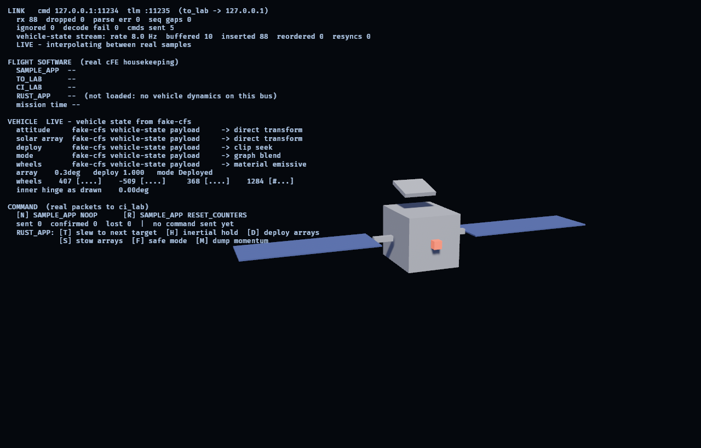
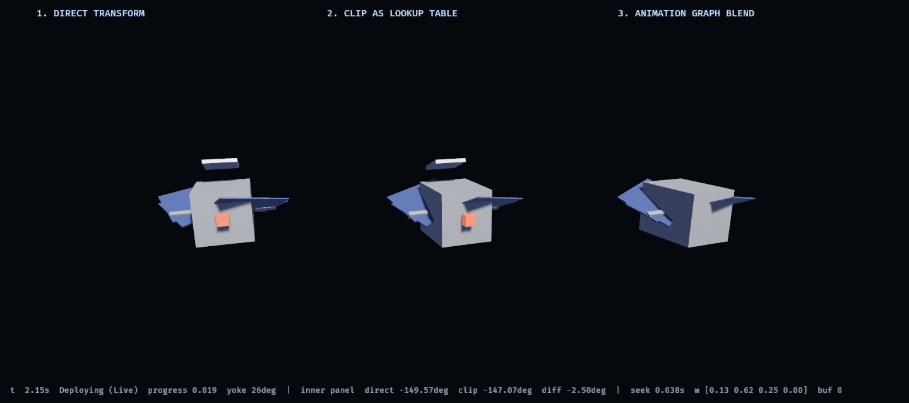

# cFS ↔ Bevy investigation

Can a Bevy (Rust) animation layer be driven by NASA core Flight System
telemetry — and can Rust live inside cFS itself? See [PLAN.md](PLAN.md) for the
phases, gates and risks; [docs/findings/](docs/findings/) for answers as they
land.

## State

**Phases 0-5 complete.** `apps/viz` runs against the containerized cFS v7.0.1,
decodes real telemetry, animates it, and closes the command loop. And the
telemetry it animates is now produced by a **cFE application written in Rust,
running inside that container**: `spikes/rust-cfs-app` integrates rigid-body
attitude dynamics and reaction-wheel control and publishes the result on the
software bus, so the spacecraft on screen is being flown by flight software
rather than described by a generator.


Every row in that panel names a real cFE field. That is new: until Phase 5 the
attitude and wheel rows read `-- no source --`, because **stock cFS publishes no
vehicle dynamics at all** — no attitude, no joint angles, no wheel speeds, since
those come from a mission's own applications and the bundle ships none. The way
to close that gap was to write the missing application, and the interesting part
is that it shares its code with the ground:

```
crates/vehicle-dyn  --compiled into-->  spikes/rust-cfs-app  (inside cFE)
                    --compiled into-->  tools/fake-cfs       (a host process)
                    --compiled into-->  apps/viz --offline   (the renderer)
```

One `no_std` crate for the vehicle model, one function for the wire format
(`telemetry_model::encode_vehicle_state`), no second copy anywhere and no C
header to drift out of sync. `docker/Dockerfile` builds the flight application
against the same source files `cargo test --workspace` compiles.

Nothing about the dynamics was hard. **Allocating three message IDs** was, and
it failed twice without producing a single error message — once by working for
the wrong reason, once by receiving commands nobody sent. See
[0007](docs/findings/0007-vehicle-dynamics-in-cfe.md).

The verification backlog is closed. Confirmed against the real build: message
IDs, `to_lab` command code and payload, timestamp layout and epoch, the command
checksum algorithm, and payload endianness (**little-endian** for this target).

Decoding the first real *payload* also found a four-octet offset bug that had
survived three phases: `CFE_MSG_TelemetryHeader_t` carries an alignment spare, so
cFE payloads start at octet **16**, not 12. Nothing errors when you get it wrong
— you just get plausible garbage. See
[0005](docs/findings/0005-vertical-slice.md).

Phase 2's rate-mismatch layer holds: a jitter buffer that plays back two
telemetry periods behind, interpolating between real samples and **never
extrapolating** — past the newest sample it holds and reports staleness, because
a display that keeps animating after telemetry stops is inventing data. Verified
against induced packet loss, reordering and signal loss in
[headless tests](crates/bevy_cfs/tests/headless.rs).

Three things worth knowing up front:

- **The viz still refuses to invent a signal.** It shows `-- no source --` for
  anything nothing on the bus carries, and against a cFS *without* the Rust
  application loaded that is still most of the vehicle — which is the honest
  measurement of how much of a spacecraft a stock cFS describes. A test asserts
  it.
- **It also does not take a packet's word for who wrote it.** `fake-cfs` and the
  flight application emit byte-identical packets on the same message ID, because
  they share the encoder, so the packet cannot identify its own author. The
  panel's "inside cFE" claim rests on `RUST_APP`'s own housekeeping being on the
  bus — evidence the vehicle packet cannot manufacture.
- **`to_lab` needs this machine's IPv4 address as cFS sees it.** Under Docker
  Desktop that is the host gateway (`--dest-ip 192.168.65.254`), never
  `127.0.0.1` and never the IPv6 `host.docker.internal`. An earlier finding
  concluded Docker Desktop blocks container→host UDP; it does not, and 0005
  records how that mistake was made.

| Crate | Purpose | std |
|---|---|---|
| [crates/ccsds](crates/ccsds) | CCSDS space packet codec, zero-copy | no_std |
| [crates/cfs-msg](crates/cfs-msg) | cFE message IDs, lab commands, real housekeeping payloads | no_std |
| [crates/telemetry-model](crates/telemetry-model) | Decoded telemetry as domain state + interpolation | no_std |
| [crates/telemetry-anim](crates/telemetry-anim) | Telemetry→animation mapping maths, no Bevy | no_std |
| [crates/vehicle-dyn](crates/vehicle-dyn) | Attitude dynamics, reaction wheels, mission sequencer — **runs inside cFE** | no_std |
| [crates/cfs-link](crates/cfs-link) | UDP transport, handshake, link health | std |
| [crates/bevy_cfs](crates/bevy_cfs) | Bevy plugin: resources, systems, playback | std |
| [tools/fake-cfs](tools/fake-cfs) | Synthetic cFS: telemetry generator and fixture replayer | std |
| [tools/tlm-capture](tools/tlm-capture) | Record real telemetry to a fixture | std |
| [tools/gltf-gen](tools/gltf-gen) | Generates `assets/spacecraft.gltf` — the rig is source code | std |
| [spikes/anim-mappings](spikes/anim-mappings) | Phase 3: three animation mappings, side by side | std |
| [spikes/rust-cfs-app](spikes/rust-cfs-app) | Phase 5: a cFE application in Rust, flying the vehicle | std |
| [apps/viz](apps/viz) | Phase 4: the vertical slice — live cFS in, commands out | std |

The five `no_std` crates must never gain a Bevy dependency: they are what gets
reused on the flight side. Four of them now genuinely are — `ccsds`, `cfs-msg`,
`telemetry-model` and `vehicle-dyn` are compiled into `spikes/rust-cfs-app` and
loaded by cFE ES — so this is a constraint with teeth rather than a convention.

`bevy_cfs` takes `bevy` with `default-features = false` — ECS and time, no
renderer — so the workspace tests headlessly without a GPU. `apps/viz` and
`spikes/anim-mappings` are the only crates allowed to want one.

## Run the vertical slice

```sh
docker compose -f docker/compose.yaml up -d --build          # cFS in a container
cargo run -p viz -- --dest-ip 192.168.65.254                 # the host, as cFS sees it
```

Press **N** to send a `SAMPLE_APP` no-op and **R** to reset its counters. The
panel shows the round trip: the command goes out over UDP 1234, `sample_app`
increments `CommandCounter` on the flight side, and the next housekeeping packet
brings it back — typically 1-5 s later, because the cadence is a scheduler tick,
not network latency.

Six more keys command the *vehicle* rather than a counter, and their round trip
is visible as motion — press **T** and the model slews, because flight software
integrated a new attitude and published it:

| Key | Command |
|---|---|
| **T** | Slew to the next pointing target |
| **H** | Inertial hold — freeze on the current attitude |
| **D** / **S** | Deploy / stow the solar arrays |
| **F** | Safe mode — give up pointing, damp the rates |
| **M** | Dump the reaction wheels' stored momentum |

**H** and **F** are deliberately different and look different: inertial hold
keeps the attitude controller running and stays put, safe mode abandons pointing
entirely and coasts to a stop wherever it is.

The vehicle also flies itself — it detumbles, deploys its arrays and walks a
pointing survey with no ground input at all, so connecting late finds a
spacecraft already at work rather than one waiting to be asked.

Without a container:

```sh
cargo run -p fake-cfs -- serve --cmd-port 11234 --tlm-port 11235 --rate 8
cargo run -p viz -- --cmd-port 11234 --tlm-port 11235
cargo run -p viz -- --offline                                 # no socket at all
```



Worth comparing against the live capture above. Same vehicle, same packet
layout, same model — `fake-cfs` runs `vehicle-dyn` in a host process instead of
inside cFE. The panel reports the difference rather than glossing it: the source
column reads `fake-cfs vehicle-state payload` and the flight-software block says
`RUST_APP -- (not loaded)`.

`--noop-every SECONDS` drives the command path on a timer, for recordings.
Findings: [0005](docs/findings/0005-vertical-slice.md),
[0007](docs/findings/0007-vehicle-dynamics-in-cfe.md).

## See the three animation mappings

```sh
cargo run -p gltf-gen                  # regenerate the rig (checked in, but reproducible)
cargo run -p anim-mappings             # synthetic telemetry
cargo run -p anim-mappings -- --live   # against fake-cfs or a running cFS
```

Three copies of the same spacecraft, reading the same telemetry in the same
frame, differing in exactly one mechanism between adjacent columns: direct
transform drive, clip-seek, and `AnimationGraph` blending. The readout prints
the inner hinge angle as computed by direct drive *and* as read back from the
clip-driven `Transform`, so the divergence between the two is on screen.

Screenshots are deterministic — the timeline steps at a fixed rate, so stateful
cross-fades reproduce exactly:

```sh
cargo run -p anim-mappings -- --screenshot out.png --at 2.15   # mid mode-transition
```



That is the frame the command above produces: one telemetry state, three
mechanisms, and the divergence between direct drive and the clip-driven
`Transform` printed along the bottom.

Findings: [docs/findings/0004-animation-mappings.md](docs/findings/0004-animation-mappings.md).

## Watch it animate, without cFS

```sh
cargo run -p fake-cfs -- serve --cmd-port 11234 --tlm-port 11235 --rate 10
cargo run -p bevy_cfs --example headless_viz -- --cmd-port 11234 --tlm-port 11235
```

Prints the interpolated state each frame, with link health and freshness. Uses
non-default ports because the cFS container publishes 1234.

## Try it without cFS

```sh
# terminal 1 — pretends to be ci_lab + to_lab
cargo run -p fake-cfs -- serve --rate 20

# terminal 2 — sends the enable-output command, records what comes back
cargo run -p tlm-capture -- --seconds 5 --out fixtures/demo.cfspkt
```

Expected: `tlm-capture` reports captured packets and lists the message IDs it
saw. `fake-cfs` withholds telemetry until the enable-output command arrives,
exactly as `to_lab` does, so this exercises the real handshake.

## With cFS

```sh
docker compose -f docker/compose.yaml up -d --build
```

See [docker/README.md](docker/README.md) for ports (telemetry is on **2234**, not
the 1235 in older docs), capturing fixtures, and the gotchas already encoded in
the compose file.

## Tests

```sh
cargo test --workspace

# the no_std crates, actually built no_std — see finding 0004
cargo check -p ccsds          --no-default-features
cargo check -p cfs-msg        --no-default-features
cargo check -p telemetry-model --no-default-features --features libm
cargo check -p telemetry-anim  --no-default-features --features libm
cargo check -p vehicle-dyn     --no-default-features --features libm
```

No network, no cFS, no container required.

## Next

1. **Try the `native_eds` build configuration.** Still the highest-leverage
   remaining question, and Phase 5 sharpened it considerably: the Rust
   application's three message IDs are hand-picked constants verified by dumping
   two binary tables, and getting them wrong produced no error either time. EDS
   would make topic-ID allocation the single source of truth for both flight and
   ground. Expect different message IDs — the golden tests are the tripwire.
2. **Table services.** `CFE_TBL_*` is the one cFE subsystem the Rust application
   still has not touched, and the gains and inertia it flies with are compile-time
   constants that a real application would carry in a table. Tables involve a
   memory-sharing and CRC-validation model a Rust struct must match byte for
   byte; whether that is comfortable is an open question.
3. **Close the `CFE_ES_ExitApp` blocker** from
   [0006 §4](docs/findings/0006-rust-cfs-app.md) — an app that has caught a panic
   can never report its exit status, and what ES does with a task that silently
   dies is untested.
4. Command authentication. `ci_lab` accepts any well-formed datagram on UDP 1234
   with checksum validation switched off, which is fine for a lab build and worth
   saying out loud before anyone points this at something that matters. It now
   matters slightly more: those datagrams change the vehicle's attitude.
