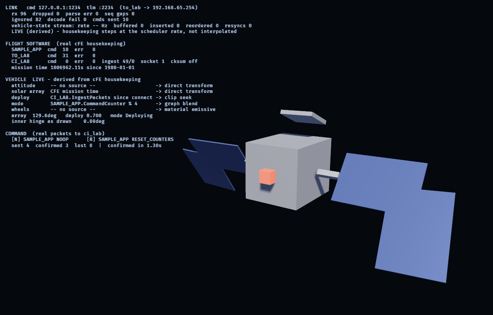

# cFS ↔ Bevy investigation

Can a Bevy (Rust) animation layer be driven by NASA core Flight System
telemetry — and can Rust live inside cFS itself? See [PLAN.md](PLAN.md) for the
phases, gates and risks; [docs/findings/](docs/findings/) for answers as they
land.

## State

**Phases 0-4 complete.** `apps/viz` runs against the containerized cFS v7.0.1,
decodes real telemetry, animates it, and closes the command loop: a keypress
becomes a real `SAMPLE_APP` no-op on the software bus, and the counter it
increments comes back on the downlink and moves the model.



The verification backlog is closed. Confirmed against the real build: message
IDs, `to_lab` command code and payload, timestamp layout and epoch, the command
checksum algorithm, and payload endianness (**little-endian** for this target).

Decoding the first real *payload* also found a four-octet offset bug that had
survived three phases: `CFE_MSG_TelemetryHeader_t` carries an alignment spare, so
cFE payloads start at octet **16**, not 12. Nothing errors when you get it wrong
— you just get plausible garbage. See
[0005](docs/findings/0005-vertical-slice.md).

Phase 2's rate-mismatch layer holds: a jitter buffer that plays back two
telemetry periods behind, interpolating between real samples and **never
extrapolating** — past the newest sample it holds and reports staleness, because
a display that keeps animating after telemetry stops is inventing data. Verified
against induced packet loss, reordering and signal loss in
[headless tests](crates/bevy_cfs/tests/headless.rs).

Two things worth knowing up front:

- **Stock cFS publishes no vehicle dynamics.** No attitude, no joint angles, no
  wheel speeds — those come from a mission's own applications. The viz shows
  `-- no source --` for the signals that do not exist rather than filling them
  in, and names the real cFE field behind every one that does.
- **`to_lab` needs this machine's IPv4 address as cFS sees it.** Under Docker
  Desktop that is the host gateway (`--dest-ip 192.168.65.254`), never
  `127.0.0.1` and never the IPv6 `host.docker.internal`. An earlier finding
  concluded Docker Desktop blocks container→host UDP; it does not, and 0005
  records how that mistake was made.

| Crate | Purpose | std |
|---|---|---|
| [crates/ccsds](crates/ccsds) | CCSDS space packet codec, zero-copy | no_std |
| [crates/cfs-msg](crates/cfs-msg) | cFE message IDs, lab commands, real housekeeping payloads | no_std |
| [crates/telemetry-model](crates/telemetry-model) | Decoded telemetry as domain state + interpolation | no_std |
| [crates/telemetry-anim](crates/telemetry-anim) | Telemetry→animation mapping maths, no Bevy | no_std |
| [crates/cfs-link](crates/cfs-link) | UDP transport, handshake, link health | std |
| [crates/bevy_cfs](crates/bevy_cfs) | Bevy plugin: resources, systems, playback | std |
| [tools/fake-cfs](tools/fake-cfs) | Synthetic cFS: telemetry generator and fixture replayer | std |
| [tools/tlm-capture](tools/tlm-capture) | Record real telemetry to a fixture | std |
| [tools/gltf-gen](tools/gltf-gen) | Generates `assets/spacecraft.gltf` — the rig is source code | std |
| [spikes/anim-mappings](spikes/anim-mappings) | Phase 3: three animation mappings, side by side | std |
| [apps/viz](apps/viz) | Phase 4: the vertical slice — live cFS in, commands out | std |

The four `no_std` crates must never gain a Bevy dependency: they are what gets
reused on the flight side if Architecture B goes ahead.

`bevy_cfs` takes `bevy` with `default-features = false` — ECS and time, no
renderer — so the workspace tests headlessly without a GPU. `apps/viz` and
`spikes/anim-mappings` are the only crates allowed to want one.

## Run the vertical slice

```sh
docker compose -f docker/compose.yaml up -d --build          # cFS in a container
cargo run -p viz -- --dest-ip 192.168.65.254                 # the host, as cFS sees it
```

Press **N** to send a `SAMPLE_APP` no-op and **R** to reset its counters. The
panel shows the round trip: the command goes out over UDP 1234, `sample_app`
increments `CommandCounter` on the flight side, and the next housekeeping packet
brings it back — typically 1-5 s later, because the cadence is a scheduler tick,
not network latency.

Without a container:

```sh
cargo run -p fake-cfs -- serve --cmd-port 11234 --tlm-port 11235 --rate 8
cargo run -p viz -- --cmd-port 11234 --tlm-port 11235
cargo run -p viz -- --offline                                 # no socket at all
```

`--noop-every SECONDS` drives the command path on a timer, for recordings.
Findings: [docs/findings/0005-vertical-slice.md](docs/findings/0005-vertical-slice.md).

## See the three animation mappings

```sh
cargo run -p gltf-gen                  # regenerate the rig (checked in, but reproducible)
cargo run -p anim-mappings             # synthetic telemetry
cargo run -p anim-mappings -- --live   # against fake-cfs or a running cFS
```

Three copies of the same spacecraft, reading the same telemetry in the same
frame, differing in exactly one mechanism between adjacent columns: direct
transform drive, clip-seek, and `AnimationGraph` blending. The readout prints
the inner hinge angle as computed by direct drive *and* as read back from the
clip-driven `Transform`, so the divergence between the two is on screen.

Screenshots are deterministic — the timeline steps at a fixed rate, so stateful
cross-fades reproduce exactly:

```sh
cargo run -p anim-mappings -- --screenshot out.png --at 2.15   # mid mode-transition
```

Findings: [docs/findings/0004-animation-mappings.md](docs/findings/0004-animation-mappings.md).

## Watch it animate, without cFS

```sh
cargo run -p fake-cfs -- serve --cmd-port 11234 --tlm-port 11235 --rate 10
cargo run -p bevy_cfs --example headless_viz -- --cmd-port 11234 --tlm-port 11235
```

Prints the interpolated state each frame, with link health and freshness. Uses
non-default ports because the cFS container publishes 1234.

## Try it without cFS

```sh
# terminal 1 — pretends to be ci_lab + to_lab
cargo run -p fake-cfs -- serve --rate 20

# terminal 2 — sends the enable-output command, records what comes back
cargo run -p tlm-capture -- --seconds 5 --out fixtures/demo.cfspkt
```

Expected: `tlm-capture` reports captured packets and lists the message IDs it
saw. `fake-cfs` withholds telemetry until the enable-output command arrives,
exactly as `to_lab` does, so this exercises the real handshake.

## With cFS

```sh
docker compose -f docker/compose.yaml up -d --build
```

See [docker/README.md](docker/README.md) for ports (telemetry is on **2234**, not
the 1235 in older docs), capturing fixtures, and the gotchas already encoded in
the compose file.

## Tests

```sh
cargo test --workspace

# the no_std crates, actually built no_std — see finding 0004
cargo check -p ccsds          --no-default-features
cargo check -p cfs-msg        --no-default-features
cargo check -p telemetry-model --no-default-features --features libm
cargo check -p telemetry-anim  --no-default-features --features libm
```

No network, no cFS, no container required.

## Next

1. **Try the `native_eds` build configuration.** Now the highest-leverage
   remaining question: it decides whether flight and ground types can share one
   source of truth instead of drifting. Expect different message IDs — the golden
   tests are the tripwire.
2. **Phase 5, Architecture B:** `spikes/rust-cfs-app` — a Rust cFS application
   loaded by cFE ES. Time-boxed hard; a negative verdict is a legitimate result.
3. Command authentication. `ci_lab` accepts any well-formed datagram on UDP 1234
   with checksum validation switched off, which is fine for a lab build and worth
   saying out loud before anyone points this at something that matters.
