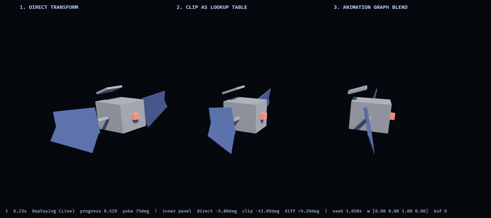

# 0004 — How telemetry should drive Bevy's animation system

**Status:** closed. Phase 3 gate met — three mappings evaluated on one rig, one
telemetry stream, with a recommendation table backed by a running demo.

**Pinned:** Bevy **0.19.1**.

## The question

Phase 2 ended with a smooth, interpolated `SpacecraftState` available every
frame. That is a *value*, not an animation. This phase asks how that value
should reach the scene, and evaluates the three candidates the plan named:

1. **Direct transform drive** — write `Transform` each frame, no `AnimationPlayer`.
2. **Clip as lookup table** — *seek* an authored clip to `progress * duration`
   instead of letting it play.
3. **Animation graph blending** — `AnimationGraph` weights driven by mode.

## The recommendation

| Signal | Example in this model | Mapping | Why |
|---|---|---|---|
| Continuous, unbounded | vehicle attitude, solar array sun tracking | **Direct transform** | No authored counterpart exists. The angle never repeats a cycle and has no end stops, so there is nothing for a clip to be a table *of*. |
| Continuous, bounded, multi-part | panel deployment, latches, docking hardware | **Clip seek** | The motion is staged and eased by a person. Telemetry owns one scalar; the artist owns everything else. |
| Discrete with transitions | mode → antenna pose, annunciator state | **Graph blend** | The value steps, but the *pose* must not. Blending is the only one of the three that has a principled answer for "between states". |
| Continuous, non-geometric | wheel RPM → glow, link health → lamp | **Neither — write the property** | None of the three mechanisms is about transforms at all here. See below. |

The headline is that **the question has no single answer, and a real scene mixes
all three in one rig.** The spike's three columns are not three candidate
designs to choose between; they are three tools, and the interesting output is
the table above rather than a winner.

## The measurement

Direct drive and clip seek were made to share *everything* that could be shared:
`telemetry-anim` owns the rig constants, the staging windows and the easing
curve, and `tools/gltf-gen` bakes the glTF keyframes by sampling that same
function. There is no hand-copied constant between them.

They still disagree, by up to **5.29°** on the inner hinge, worst at `t≈1.06 s`
of a 2 s clip:

The cause is not a bug in either. The clip stores five keyframes per hinge and
Bevy interpolates between them with `Quat::slerp`; direct drive evaluates the
smoothstep continuously. A sparse sampling of a curve is not the curve. This is
measured in two independent ways that agree to 0.01°:

- `telemetry-anim`'s `clip_vs_direct_divergence` test, in angle space, with no
  Bevy involved — 5.290°.
- The running app, reading the number back out of the `Transform` that Bevy
  actually wrote — 5.29°.

**What this means practically:** if two subsystems must agree on where a
mechanism is — say a viz and a collision or occlusion check — they have to use
the *same* mapping. Sharing constants is not enough, and "it's the same motion"
is not enough. The disagreement is silent, largest mid-travel, and zero at both
endpoints, which is exactly where a casual test would look.

## What the graph blend buys, and what it costs

`SpacecraftState::lerp` deliberately **snaps** `mode` at the interpolation
midpoint, because a blended enum would name a mode the vehicle was never in.
That is right for state and wrong for presentation: an instant pose change reads
as a glitch.

So the smoothing lives one layer up, in `ModeBlend`, where it is honest — the
reported mode still steps, and only the *pose* eases across. Columns 1 and 2
snap the antenna; column 3 cross-fades it over 0.6 s. Caught mid-fade:

Weights `[0.13 0.62 0.25 0.00]` — a genuine three-way blend, 0.15 s after the
mode stepped from Nominal to Deploying.

Two things worth knowing before adopting it:

- **Weights must stay a convex combination.** `ModeBlend` renormalizes by
  *scaling* the outgoing weights rather than subtracting a fixed step. With
  subtraction, a mode that flaps near a threshold drives a weight negative;
  `rapid_mode_flapping_stays_valid` exercises 600 frames of flapping and asserts
  the weights stay in `0..=1` and sum to 1.
- **A blended pose is a pose the artist never approved.** It is a convex
  combination of approved poses, which is safe for an antenna angle and would
  not be for anything that must avoid a collision mid-transition.

## Non-`Transform` properties

Most spacecraft telemetry is not rigid-body motion, and a mapping that only
moves things cannot show a heater duty cycle or a caution annunciator. The lamp
is driven by `Visibility` and `StandardMaterial::emissive`, from two different
signal kinds at once: a discrete blink rate, and a continuous glow scaled by
wheel RPM.

None of the three mechanisms helps here. Bevy *can* animate arbitrary properties
through `AnimatableProperty`, but for a value that is already available as a
number every frame, writing it directly is simpler and was never the bottleneck.

One rule carried up from Phase 2: **link health outranks vehicle mode on the
lamp.** A caution light driven by a frozen value is worse than no caution light,
because it asserts a condition the ground no longer knows to be true. When
telemetry goes stale the lamp reports *that*, not the last mode it saw.

## Traps found

- **Name binding is unchecked.** Clips bind to rig nodes by name
  (`AnimationTargetId`). Rename a joint in the DCC tool and the mapping silently
  unbinds — no compile error, no runtime error, the joint simply stops moving.
  This is the single largest fragility in the clip-seek approach. Phase 4 should
  fail loudly on a missing expected name.
- **Materials are shared between scene instances.** All three columns reference
  one `StandardMaterial` handle, so one write changes every copy. Fine here, and
  a trap the moment per-instance appearance is wanted — the scene loader will not
  clone it for you.
- **Asset roots are per-crate, not per-workspace.** Bevy resolves `assets/`
  against the running crate's manifest directory. A workspace needs an explicit
  `AssetPlugin { file_path }`.
- **A paused animation still poses.** Confirmed in the 0.19 source rather than
  assumed: `paused` gates event triggering and clock advancement only. This is
  what makes clip-seek work at all.
- **Bevy 0.19 moved a lot.** `SceneRoot` → `WorldAssetRoot(Handle<WorldAsset>)`,
  `EventWriter` → `MessageWriter`, `AmbientLight` resource → component (with
  `GlobalAmbientLight` as the fallback resource), `TextFont::font_size` → `FontSize`,
  `DirectionalLight::shadows_enabled` → `shadow_maps_enabled`. The plan's warning
  that Bevy's animation API changes shape every release was well founded.

## A measurement bug worth recording

The divergence first read **5.59°**, and the obvious story — that Bevy's curve
evaluation differs from angle-space interpolation — was wrong. Bevy uses
`Quat::slerp`, which for a single-axis hinge *is* linear in angle.

The real cause was that the readout compared the current frame's directly
computed angle against the previous frame's clip pose, because animation runs in
`PostUpdate` and the readout was in `Update`. The extra 0.30° was exactly one
frame of travel. Moving the readout to `PostUpdate` after `AnimationSystems`
brought it to 5.29°, matching the pure-maths test.

Two lessons. A cross-check between two independent implementations is worth more
than either alone — the disagreement is what exposed the bug. And a plausible
mechanism is not evidence: the slerp explanation was coherent, and checking the
source cost one grep.

## A latent bug this phase surfaced

`telemetry-model` declared `#![no_std]` but had **never been built without
std**. Every consumer opted into `features = ["std"]`, and a `#![no_std]` crate
can still resolve `f32::sqrt` if anything else in the build graph links `std`.
The first consumer to depend on it without `std` — `telemetry-anim` — broke
immediately.

Fixed with an explicit `libm` feature and a `compile_error!` when neither is
selected, so a build that picks neither fails with a sentence instead of a
confusing `E0599`. The general lesson: **a `no_std` claim that is never built
`no_std` is not a claim, it is a comment.**

## What Phase 4 inherits

- The mapping table above, and `telemetry-anim` as the place mapping maths lives.
- A generated, reviewable rig (`cargo run -p gltf-gen`) — no opaque binary asset.
- Deterministic screenshots: `--screenshot PATH --at SECONDS` steps a fixed-rate
  timeline so a capture is reproducible, including stateful cross-fades.
- Two open items unchanged from Phase 1: the command checksum (backlog item 6)
  and payload endianness against a real packet (item 7).
